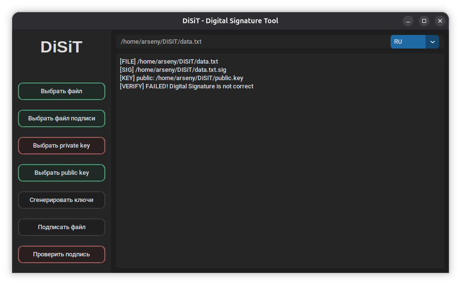

# DiSiT

[](https://github.com/BlondInchIk/DiSiT/releases/latest)
[](LICENSE)


## О проекте



Данный проект реализует алгоритм электронной цифровой подписи по стандарту  
[**ГОСТ Р 34.10-2012**](https://upload.wikimedia.org/wikipedia/commons/b/bc/%D0%93%D0%9E%D0%A1%D0%A2_%D0%A0_34.10-2012._%D0%98%D0%BD%D1%84%D0%BE%D1%80%D0%BC%D0%B0%D1%86%D0%B8%D0%BE%D0%BD%D0%BD%D0%B0%D1%8F_%D1%82%D0%B5%D1%85%D0%BD%D0%BE%D0%BB%D0%BE%D0%B3%D0%B8%D1%8F._%D0%9A%D1%80%D0%B8%D0%BF%D1%82%D0%BE%D0%B3%D1%80%D0%B0%D1%84%D0%B8%D1%87%D0%B5%D1%81%D0%BA%D0%B0%D1%8F_%D0%B7%D0%B0%D1%89%D0%B8%D1%82%D0%B0_%D0%B8%D0%BD%D1%84%D0%BE%D1%80%D0%BC%D0%B0%D1%86%D0%B8%D0%B8.pdf) на Python с использованием собственной криптографической реализации. Он позволяет генерировать ключи, создавать и проверять цифровые подписи файлов.

---

## Возможности

- Генерация ключевой пары ([private.key](private.key) / [public.key](public.key))
- Создание цифровой подписи файла
- Валидация цифровой подписи
- Кроссплатформенность (Linux / Windows)

---

## Быстрый старт

### Клонирование

```bash
git clone git@github.com:BlondInchIk/gost_34102012.git
cd gost_34102012
```

## License

MIT